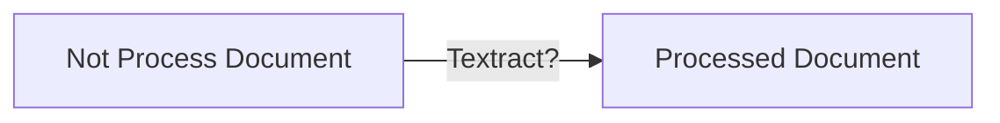
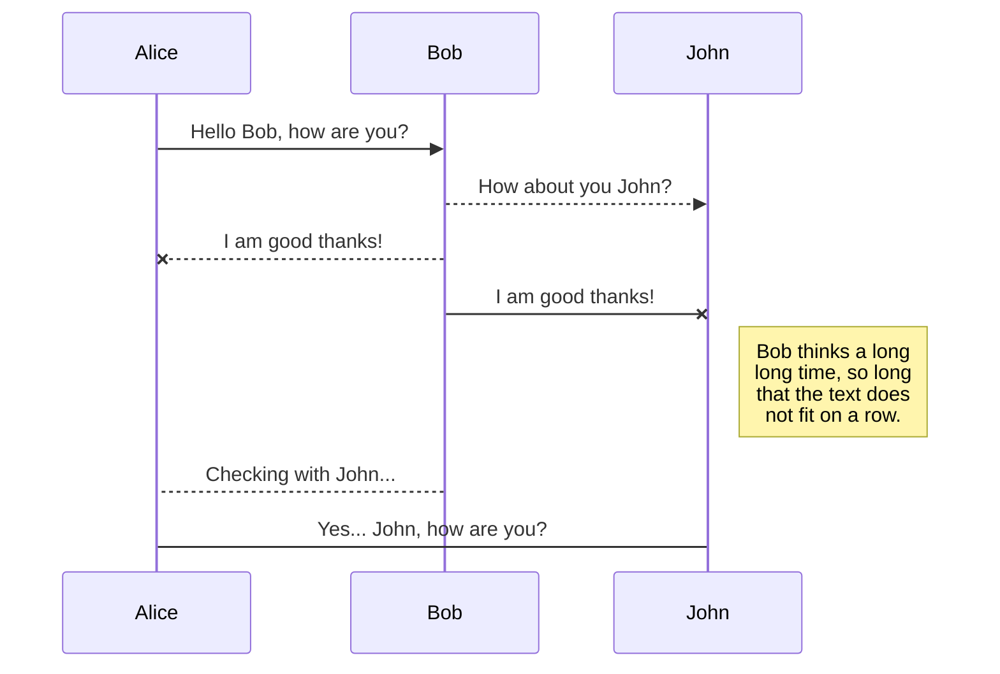
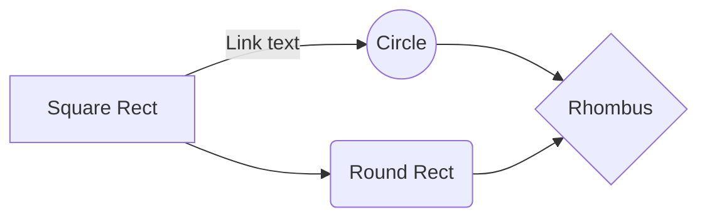
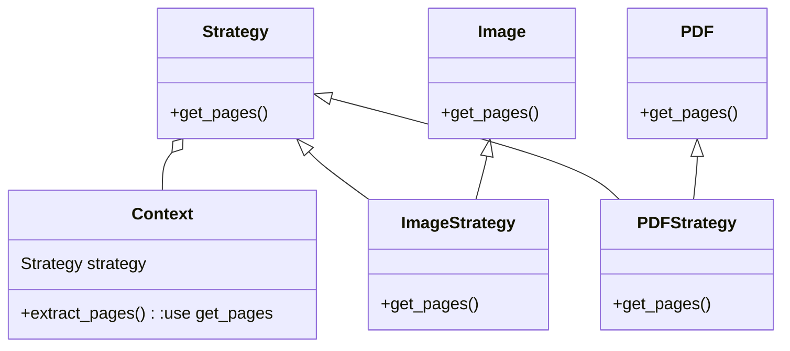

# Core

Core is the highest abstraction. It is in the root Zinobe-OCR project.
As the project works with this flow.


**core.py**: represent the basic model structures of BasicDocument and ProcessedDocument.

## extractor.py

The main idea behind the extractor is receive a list of dictionaries. Each dict contains the page info, as [blocks](https://docs.aws.amazon.com/textract/latest/dg/how-it-works-document-layout.html).
The extractor has FormExtractor, TablesExtractor and TextExtractor. Each one of them can return a csv string or a list of objects.

**TablesExtractor**: returns a list of list with this structure.

```python
[
	page_1, page_2, ..., page_n
]
```

where page_n structure is

```python
page_n = [
	table_1, table_2, ..., table_n
]
```

and table_n structure is

```python
table_n = {
	"1":{"col_1", "col_2", ... , "col_n" },
	"2":{"col_1", "col_2", ... , "col_n" },
	...
	"n":{"col_1", "col_2", ... , "col_n" }
}
```

Notice that col_1 has a value, i.e "col1":"value".
So, the table can be reference as:

```python
table_n[n][col_n]
```
**FormsExtractor**  returns a list of forms by page. Each page has **one** form.

```python
[
	page_1, page_2, ..., page_n
]
```

where page_n structure is

```python
page_n = [
	form_1, form_2, ..., form_n
]
```

and form_n structure is

```python
form_n = {
	"key_1":"val_1",
	"key_2":"val_2",
	...
	"key_n":"val_n",
}
```

**TextExtractor**  returns a list of lines by page.

```python
[
	page_1, page_2, ..., page_n
]
```

where page_n structure is

```python
page_n = [
	lines_1, lines_2, ..., lines_n
]
```

and lines_n structure is

```python
lines_n = ["line_1", "line_2", ... , "line_n"]
```

## File processing

Core can process images ["png", "jpg", "jpeg"] and pdf files ["pdf"] through PDF and Image classes. The third party library used here is [PyMuPDF-fitz](https://documentation.help/PyMuPDF//genindex.html).  

# Exceptions

## System errors

* Files

| Status Code | Code           | Detail                  |
| ----------- | -------------- | ----------------------- |
| 1000        | file_binaries  | File binaries not found |
| 1001        | fitz_file      | Fitz not open file      |
| 1002        | media_type     | Media type not found    |
| 1003        | textract_dic   | Textract dict not found |
| 1004        | file_extension | File has not extension  |
| 1005        | import_error   | Can not import          |

# Django Applications

This project uses two apps: **documents** and **statements**.

### Documents

Project that allows to process any kind of image/pdf with text.
It returns the document tables, forms and text. 

### Statements

This app analyze bank statements, extracting the main client info (master data) and detail transactions inside tables (detail data).

## Processing documents

To process a document, this projects supports the charge through **django-admin** or **api**.
To handle the post event, we use [signals](https://docs.djangoproject.com/en/3.0/topics/signals/#connecting-to-signals-sent-by-specific-senders).
Using the API, the post event is started with just Model.save() in ORM style.

>**Note**: The api is builded with [django-rest-framework.org](https://www.django-rest-framework.org/)

## API

This projects use [django-rest-framework.org](https://www.django-rest-framework.org/) to handle api request. 
The exceptions are formerly in the exceptions.py file inside each app. These are built with [custom exceptions](https://www.django-rest-framework.org/api-guide/exceptions/#custom-exception-handling).
Custom errors messages are in constants.py file.

# [Celery](http://www.celeryproject.org/)

As **Textract** can not handle with simultaneous analyzing document process, this project uses queues to handle with. 
During process document inside, `tasks.py`. Using *@shared_task(bind=True)* the task_id is saved in ProcessDocument model.
This ProcessDoc->task_id is recovered in admin.py.

## To do list

- [ ] Strategy pattern to use Textract or other service 

# Packages

## File Manager

This package get the document that can be pdf or image (TODO, it validates) and extract its pages in bytes list.
If file is image, it returns a list of one image.


# Microkernel Architecture
As this project has a core, the apps inherits from it.
The plugins of this projects are inside the apps folder (plugins).
This plugins has a config.
The importation of the plugin, i.e statement/plugins/bancolombia/... is managed trough `__init__.py`file inside plugins folder. It has a **factory method** that uses dynamic import to return the `bancolombia.main.Bancolombia` class.

# Notes
The default storage used in this project is [django-storages](https://django-storages.readthedocs.io/en/latest/).
So, you will notice that the file is uploaded automatically and you won't find how...

## SmartyPants

SmartyPants converts ASCII punctuation characters into "smart" typographic punctuation HTML entities. For example:

|                  | ASCII                           | HTML                          |
| ---------------- | ------------------------------- | ----------------------------- |
| Single backticks | `'Isn't this fun?'`             | 'Isn't this fun?'             |
| Quotes           | `"Isn't this fun?"`             | "Isn't this fun?"             |
| Dashes           | `-- is en-dash, --- is em-dash` | -- is en-dash, --- is em-dash |

## KaTeX

You can render LaTeX mathematical expressions using [KaTeX](https://khan.github.io/KaTeX/):
The *Gamma function* satisfying 

$\Gamma(n) = (n-1)!\quad\forall n\in\mathbb N$ 

is via the Euler integral

$$
\Gamma(z) = \int_0^\infty t^{z-1}e^{-t}dt\,.
$$

> You can find more information about **LaTeX** mathematical expressions [here](http://meta.math.stackexchange.com/questions/5020/mathjax-basic-tutorial-and-quick-reference).

## UML diagrams

You can render UML diagrams using [Mermaid](https://mermaidjs.github.io/). For example, this will produce a sequence diagram:



And this will produce a flow chart:



