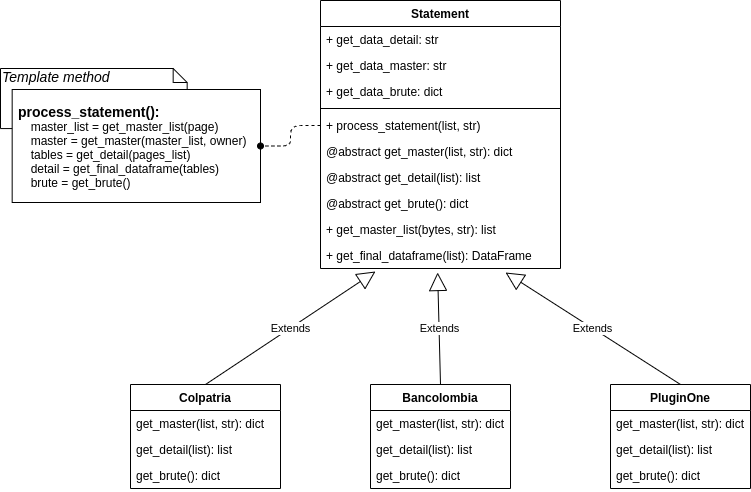

# Plugin

creating a plugin for processing bank statements consists of a folder with the following elements:

- main.py: contain the main logic of the plugin
- config.json: contain the plugin configuration information
- constans.py: contain the constants that the plugin uses

#### Folder example:

    plugin_one
    ├── main.py
    ├── config.json
    └── constans.py

Plugins are built using the template method pattern, look at the following class diagram



## Creating the main.py

Rules:

- There must be a class with the name of the plugin in capitalize style
- Import the abstract class Statement of the module mixins
- It must be inherited from this class and override its abstract methods:
    - get_master()
    - get_detail()
    - get_brute()

#### Example:

```python
from ..mixins import Statement


class PluginOne(Statement):
    """Analyzes PluginOne bank statements."""

    def __init__(self):
        super().__init__()

    def get_master(self, master_list, owner):
        result_master = some_operation()
        return result_master

    def get_detail(self, pages_list):
        result_detail = some_operation()
        return result_detail

    def get_brute(self):
        result_brute = some_operation()
        return result_brute
```

<div class="note">
    <strong>Note: </strong>
    To find out what the method should do, what parameters it should receive and what it should return, consult the method documentation in the abstract class Statement
</div>

## Creating the cofing.json

You must create a file called cofing.json where the plugin configuration parameters are

#### Example:

```json
{
  "name": "plugin_one",
  "related_name": "plugin one col",
  "description": "Plugin for processing bank statements of plugin one",
  "versiion": 1.0,
  "region": "CO",
  "region_name": "colombia",
  "autor": "plugins developer"
}
```
Parameters:

- name: must be the same name as the plugin folder
- description: plugin description
- region: corresponds to the country where the plugin is used

## Creating the constans.py

<div class="warning">
    <strong>Warning: </strong>
    This section is under construction.
    Not essential for creating the plugin
</div>

## Plugin implementation

Finally the plugin can be implemented as follows

```python
from plugins.plugin_one.main import PluginOne

# line that simulates the extraction of pages
list_of_pages = extract_pages_in_pdf('file_plugin_one.pdf')
owner = "test file on plugin one"

# plugin instance
statement = PluginOne()

# call principal method
statement.process_statement(list_of_pages, owner)

# get data using properties
detail = statement.get_data_detail
master = statement.get_data_master
brute = statement.get_data_brute
```