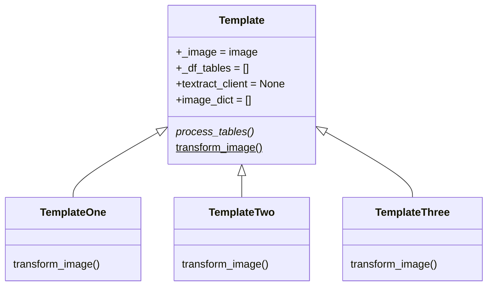

# Template

A template is a process that is applied to an image to improve the extraction of information.

A template is created in a python module and must be put in the ```core/templates``` folder. Example: template_one.py


Templates are built using the template method pattern, look at the following class diagram



## Creating the template_one.py

Rules:

- Import the abstract class Statement of the module mixins
- It must be inherited from this class and override its abstract methods:
    - transform_image()

#### Example:

**In creating the template you can use the opencv package with its different utilities already developed.**

```python
from packages.opencv import Image
from .mixins import Template


class TemplateOne(Template):
    """This template draws rectangles around each text element in the image."""

    def __init__(self, image):
        super().__init__(image)
        self.open_cv_tool = Image()

    def draw_rectangles_in_word(self):
        """draw rectangles around each text element in the image."""
        return self.open_cv_tool.rectangle_image(self._image)

    def transform_image(self):
        self._image = self.draw_rectangles_in_word()

```

<div class="note">
    <strong>Note: </strong>
    To find out what the method should do, what parameters it should receive and what it should return, consult the method documentation in the abstract class Template
</div>


## Template implementation

Finally the template is implemented when creating a plugin.

[See the creation of plugins](plugin.md)
