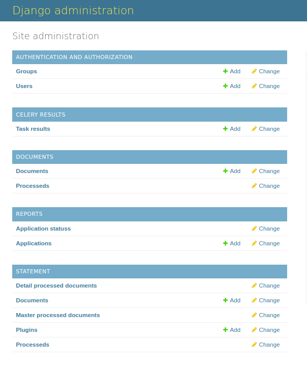
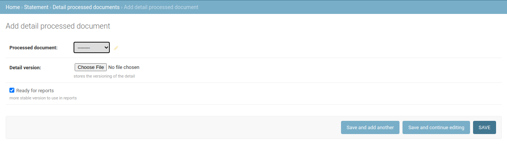

# User Manual

Below is a guide for some of the features that zinobe-ocr provides
<div class="note">
    <strong>Note: </strong>
    the platform is presented in django-admin
</div>
Main menu image



## File processing

### Bank statements

Processes a bank statement, extracting its content into two files: **master** and **detail**

**master**: Save in a ```.csv``` file data such as: the owner of the bank statement, the account number, the type of account, among others.

**detail**: Save the details of all bank statement transactions in a ```.csv``` file


#### Processing a new bank statement


To create a new document taking into account:

- Name: guide name for the process
- Storage path: file to process
- Bank: name of the bank
- Application model: [application model](#application-and-its-status)
- User: user processing

Once you save the document it starts to process.


If the document processes correctly, its status changes to processed and you can download the master and the detail


**Image of the master, opened with LibreOffice.**


**Image of the detail, opened with LibreOffice.**


<div class="note">
    <strong>Note: </strong>
    The structure of the master and the detail may change depending on the type of bank
</div>

#### Versioning documents

Document versioning consists of uploading a new corrected ```csv``` document from an already processed document, so that with it reports are generated regarding bank statements.

When the details and master of a document are downloaded, it is guaranteed that at least 70% of the information is correct. To generate reports of the documents, it is necessary that 100% of the information is correct, in such a way that the errors that the downloaded ```csv``` files have must be manually corrected, finally the corrected file must be uploaded to the ocr platform.

<div class="note">
    <strong>Note: </strong>
    70% is a relative value, sometimes the percentage will be higher.
</div>



To create a version of a document keep in mind:

- Processed document: document to which the new version will be added
- Detail(or Master) version: ```csv``` file corrected
- Ready for reports: check to activate this document is ready for reports

### Generic documents

Processes any document of type pdf or image


It works similar to **Statement**, only it doesn't organize the information in the same way

Once the document is processed you can download the **tables**, the **text** and the **forms**


## Reports

### Context and Flow

Reports show statistics on a common document set

**Rules:**

1. The set of documents must correspond to 6 consecutive months of bank statements. Example: January, February, March, April, May and June

2. All documents must be of the same account type. (savings account or current account)

3. All documents must be from the same owner with the same account number

4. All documents must be processed under the same application model. [See process bank statements](#processing-a-new-bank-statement)

**Flow:**

1. Process all documents under the same application model
2. Download the master and the detail of each document
3. Correct each document and [upload the new version](#versioning-documents)
4. Update the application
5. Consume the indicator service
6. Consume the graphics service

### Application and its status


The **application** stores general information on the set of documents for reports: account type, account number, owner, among others.


<div class="note">
    <strong>Note: </strong>
    The application information is automatically updated with the latest master version of the last document in the set
</div>

The **application status** stores information regarding the reports generated: how many months were processed, how many days, if it was processed correctly, among others

<div class="note">
    <strong>Note: </strong>
    The information in the application status is updated automatically when it consumes the indicators and graphs service
</div>

### Indicators

Consume the indicators service to have a ```.json``` file with the statistics of the set of documents.

The json generated by this service is also saved in the indicators field of application status

This service must be consumed through an API-Rest, consult the [documentation of the API](http://127.0.0.1:8000/api/v2/docs/).

### Graphics

Consume the graphics service to have a ```.json``` file with the graphics of the set of documents

The json generated by this service is also saved in the graphics field of application status

This service must be consumed through an API-Rest, consult the [documentation of the API](http://127.0.0.1:8000/api/v2/docs/). 